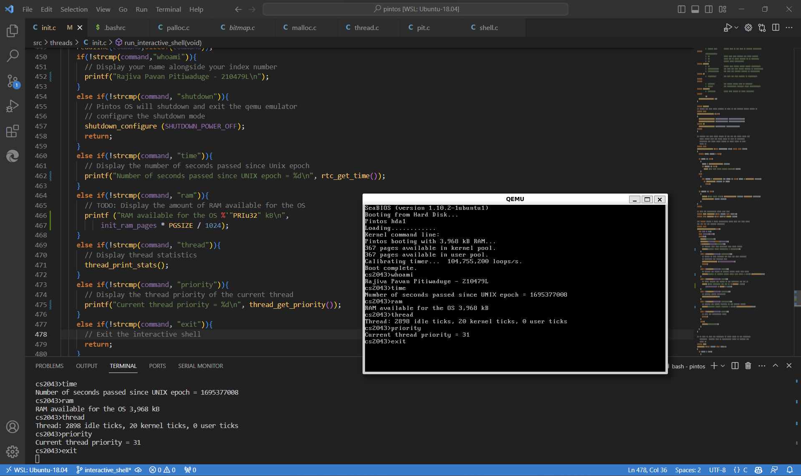

# Threads 🧵

## Project 0 - Interactive Shell 🐚



### Description 📜
A simple interactive shell that can run the following commands.
- `whoami` - prints the name and index number
- `ram` - prints the amount of RAM available for the OS
- `time` - prints the number of seconds since the UNIX epoch
- `thread` - prints the current thread's statistics
- `priority` - prints the current thread's priority
- `exit` - exits the shell
- `shutdown` - shuts down the OS


### Code 📝

Added 
```c
run_interactive_shell()
static bool backspace (char **pos, char line[]);
static void readline (char line[], size_t size);
``` 
methods to `src/threads/init.c`


